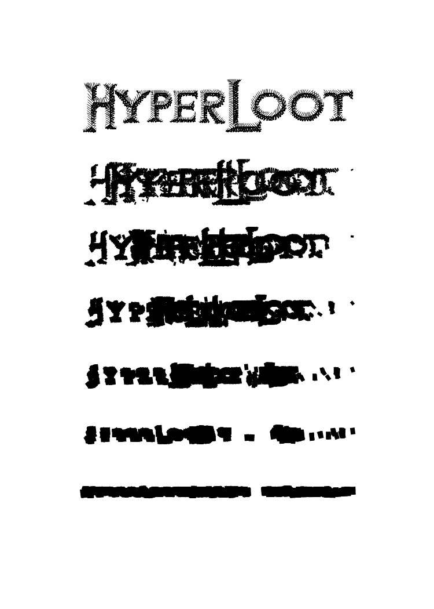

# HyperLoot-Card-Back-Art-Contest

My submission for HyperLoot Card Back Art Contest

## Finished artwork

## Workflow

1. Draw with Krita
   1. Use Line tool with vector layer
2. Export as .svg
   1. Parse svg with Bash, and shape values with Julia
3. Animate via SMIL
   1. Generate .svg with Julia
   2. Render each frames as .png with svg2movie
4. Merge some frames with Krita
   1. And place it on template

## Reference Links

HyperLoot Card - Decentralized Card Game
<https://hyperlootproject.com/hyperloot-card/>

HyperLoot Card Back Template
<https://hyperlootproject.com/hyperloot-card/hyperloot-card-back-white-template.png>

HyperLoot logo image
<https://hyperlootproject.com/hyperloot-logo@2x.png>
